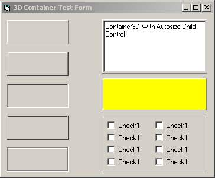



## Container 3D ActiveX w/Source

### Description

I wanted a better looking container control than using a picture box or a frame so I decided to make this. Complete source code included. Includes many different looks, autosizing of a child control to fit the container3d control, mouse enter and mouse exit events. *Updated Now To Include Transparent/Opaque BackStyle Property.
 
### More Info
 

             |
---                |---
**Submitted On**   |2000-07-09 21:02:44
**By**             |[Shannon Harmon](https://github.com/Planet-Source-Code/PSCIndex/blob/master/ByAuthor/shannon-harmon.md)
**Level**          |Beginner
**User Rating**    |4.7 (14 globes from 3 users)
**Compatibility**  |VB 3\.0, VB 4\.0 \(16\-bit\), VB 4\.0 \(32\-bit\), VB 5\.0, VB 6\.0, VB Script, ASP \(Active Server Pages\) 
**Category**       |[OLE/ COM/ DCOM/ Active\-X](https://github.com/Planet-Source-Code/PSCIndex/blob/master/ByCategory/ole-com-dcom-active-x__1-29.md)
**World**          |[Visual Basic](https://github.com/Planet-Source-Code/PSCIndex/blob/master/ByWorld/visual-basic.md)
**Archive File**   |[CODE\_UPLOAD7629792000\.zip](https://github.com/Planet-Source-Code/shannon-harmon-container-3d-activex-w-source__1-9601/archive/master.zip)

